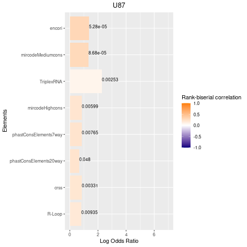
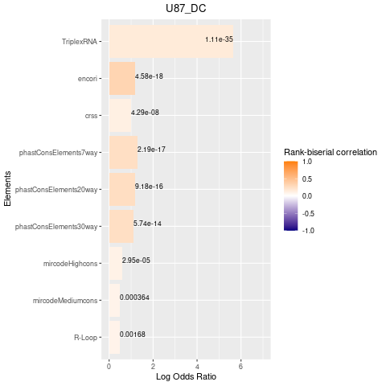

# CRISPR Hit Enrichment Analysis Pipeline (CHEAP)

`CHEAP` provides a **TXT** file with the ranking of the enriched genomic elements found in experimentally functional Long Non-coding RNA (LncRNA) exons. `CHEAP` preprocesses `MAGeCK IBAR` output files containing the results from the CRISPR screens, and performs statistical tests in order to rank the enrichment of genomic elements. It automatically detects **BED** and **CSV** files found in the input folders. In addition to the result files, the output can be plotted into a **PNG** file with the use of auxiliary scripts.

The core of this tool is [pybedtools](https://github.com/daler/pybedtools).

---
## Setup
The pipeline makes use of 3 separate files, the main one being `hit_pipeline.py`, the accessory file `process_for_graph.py` and the R script `plot.R`. The pipeline has been tested on Linux.

It is recommended to setup a `conda` environment from the **YAML** file `cheap.yml` to install the necessary dependencies:

```bash
git clone https://github.com/MattBrod/CHEAP
cd biglibrary
conda env create -f cheap.yml
```
Remember to *activate* the enviromnent (`conda activate cheap`) before running any of the scripts.

---
# Tutorial
Data in `example_directory/test_tracks` were obtained from the following references:

- MREs: `Jeggari A, Marks DS, Larsson E. miRcode: a map of putative microRNA target sites in the long non-coding transcriptome. Bioinformatics. 2012;28(15):2062-2063.`
- CRS: `Seemann, Stefan E., et al. "The identification and functional annotation of RNA structures conserved in vertebrates." Genome research 27.8 (2017): 1371-1383.`
- phastCons: `Siepel, Adam, et al. "Evolutionarily conserved elements in vertebrate, insect, worm, and yeast genomes." Genome research 15.8 (2005): 1034-1050.`
- RIDLS: `Carlevaro-Fita J, Polidori T, Das M, Navarro C, Zoller TI, Johnson R. Ancient exapted transposable elements promote nuclear enrichment of human long noncoding RNAs. Genome Res. 2019;29(2):208-222.`.
- RNADNA_byType: `Sanz LA, Hartono SR, Lim YW, et al. Prevalent, Dynamic, and Conserved R-Loop Structures Associate with Specific Epigenomic Signatures in Mammals. Mol Cell. 2016;63(1):167-178.  & Sentürk Cetin N, Kuo CC, Ribarska T, Li R, Costa IG, Grummt I. Isolation and genome-wide characterization of cellular DNA:RNA triplex structures. Nucleic Acids Res. 2019;47(5):2306-2321.`.


The arguments for the main script are:

```bash
python3 hit_pipeline.py [-hit --hitlist] [-ex --exons] [-ct --controls] [-trc --tracks] [-int --intersections]

mandatory arguments:

  -hit, --hitlist       CSV with the raw file from MAGeCK IBAR
  -ex --exons           BED file with genomic coordinates of regions/region:exons
  -ct --controls        CSV file containing which regions in the CRISPR screen are
                        controls and what type of controls they are (oncogenes,
                        tumour supressors and neutral)
  -trc --tracks         directory of BED files of genomic elements of interest
        
optional arguments:

  -int, --intersections CSV file containing the intersection of the regions and
                        the experimental exons. It also contains the type of
                        operation of the intersection (DF, DI, DP, DC)
```

The arguments for the helper script are:

```bash
python3 process_for_graph.py [-dir --directory] [-typ --type] [-cell --cell line]

mandatory arguments:

  -dir, --directory     directory created by main script containing folders of
                        TXT files with the enrichment results
  -typ --type           argument to specify what subset of the results the user
                        wants to plot, these being divided into the timepoints
                        (highconf, lowconf, 1, 2, 3) and test groups (lncrna, onc,
                        sup, neu)
  -cell --cell line     argument to specify what cell line and operation (DF, DC, 
                        DI, DP) from the results to plot
```

The arguments for the plotting script are:

```bash
Rscript plot.R [results] [output]

mandatory arguments:

  results               TXT file obtained from the helper script
  output                name of the output file
```

With `CHEAP` you can analyze CRISPR hit enrichment in two different approaches:

## By Region Analysis

In this approach the user can obtain the genomic element enrichment found in the broad regions that contain several candidate functional LncRNAs. To run the script in this approach it is necessary to use the file with the coordinates of exons and not including the optional argument.

```bash
python3 hit_pipeline.py -hit files/OUTPUT_GENES_IBARC_RAW1.csv -ex files/regions.bed -ct files/CONTROLS.csv -trc tracks
```
This should create a results folder containing subfolders with the separate **TXT** files.

## By Region:Exon Analysis

In this approach the user can obtain the genomic element enrichment found in the candidate LncRNA exons that intersect with the broader experimental regions. To run the script it is necessary that the `[exons]` file contains the genomic coordinates of the intersections between the exons and regions. In addition, `[intersections]` has to contain the file containing the additional info about the intersections.

```bash
python3 hit_pipeline.py -hit files/OUTPUT_GENES_IBARC_RAW1.csv -ex files/intersections.bed -ct files/CONTROLS.csv -trc tracks -int files/REASSIGNMENTS.csv
```
This should create a results folder containing subfolders with the separate **TXT** files.

## Process results for plotting

The **TXT** files found in the results directory contain information about the enrichment present in the LncRNA exons. The helper script has been included to obtain the specific subset of results that the user desires to plot. If a user has done a region analysis and would like to obtain the results of a specific cell line and from the high confidence group, it can use the script the following way:

```bash
python3 process_for_graph.py -dir results -type lncrna_highconf -cell U87
```
This should create a **TXT** file in your working directory, named after the cell line e.g. *U87.txt*.
In the case that the user has done a region:exon analysis, it can choose the type of operation (DC, DP, DI, DF) as seen here:
```bash
python3 process_for_graph.py -dir results -type lncrna_highconf -cell U87_DC
```
This should create a **TXT** file named *U87_DC.txt*.

## Plotting the results

Once a file is created from the previous step, the `Rscript` can be use to create a plot bar of the results. The x-axis indicates the Log Odds Ratio obtained from the count overlap test (Fisher Exact Test) and the color gradient of the bars indicate the Rank-biserial correlation score obtained from the percentage of overlap test (Mann Whitney U test). The genomic elements are ranked taking into consideration both scores, this was done by scaling Odds Ratio scores with a log transformation and scaling the Rank-biserial correlation scores with MinMax scaler from `sklearn`. Here's an example of how to generate a plot:
```bash
Rscript plot.R U87.txt U87_plot.png
```


Here's how to plot the *U87_DC.txt* file:

```bash
Rscript plot.R U87_DC.txt U87_DC_plot.png
```


---
# About
Developed by Mateusz Brodzik, 2022.
